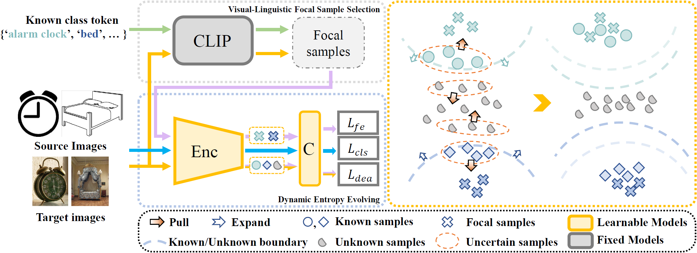

# Open-VLFE (Open-set Mixed Domain Adaptation via Visual-Linguistic Focal Evolving)
The official Pytorch implementation of our paper ``Open-set Mixed Domain Adaptation via Visual-Linguistic Focal Evolving'', TCSVT 2025.

> Open-set Mixed Domain Adaptation via Visual-Linguistic Focal Evolving
> 
> Bangzhen Liu, Yangyang Xu, Cheng Xu, Xuemiao Xu, and Shengfeng He
> 
> [Paper](https://ieeexplore.ieee.org/abstract/document/10926517)

## Environment
Python 3.9, Pytorch 2.0.1, TorchVision 0.15.2, Pytorch-lightning 2.3.3, clip 1.0. We used the pytorch-lightning library for memory efficient float16 training.

## Data Preparation

#### Datasets

The dataset we adopted in our experiments includes: 
[Office Dataset](https://people.eecs.berkeley.edu/~jhoffman/domainadapt/),
[OfficeHome Dataset](http://hemanthdv.org/OfficeHome-Dataset/), 
[VisDA](https://github.com/VisionLearningGroup/taskcv-2017-public/tree/master/classification)

Prepare dataset in data directory.

    ./data/Office31/amazon/images/ ## Office31
    ./data/OfficeHome/Real ## OfficeHome
    ./data/VisDA/Classification/train ## VisDA synthetic images
    ./data/VisDA/Classification/validation ## VisDA real images

#### File split

The file list for the datasets above are provided in ./txt folder, e.g.

    ./txt/Office31/source_amazon_obda.txt ## Office
    ./txt/OfficeHome/source_Real_obda.txt ## OfficeHome

The process scripts are provided in the "./utils/build_txt" folder, feel free to customize for any setting or new dataset by yourself.

## Training

    python train.py --expname <yourname> --dataset 'OfficeHome' 
                --source './txt/OfficeHome/source_Art_obda.txt'
                --target './txt/OfficeHome/target_cpr_obda.txt' 
                --network 'resnet50' --num_class 25 
                --batch_size 64 --num_workers 4 
                --is_train --epoch 40 
                --lr_f 0.001 --lr_n 0.01 --w_ent 0.1 --clip_thres 0.5 
                --gpu 0

<!-- ## Evaluation

[checkpoints](https://drive.google.com/drive/folders/1LCgp0oTx028X2QTSlSGs6P-HvLTCzqfJ?usp=sharing)

Download checkpoints file and place in ./checkpoints . To evaluate the performance:

    python eval.py --dataset 'Office31' --source './txt/Office31/source_dslr_obda.txt' --target './txt/Office31/target_amazon_obda.txt' --network 'resnet50' --num_class 10 --batch_size 64 --num_workers 4 --gpu 0
    python eval.py --dataset 'OfficeHome' --source './txt/OfficeHome/source_Art_obda.txt' --target './txt/OfficeHome/target_Clipart_obda.txt' --network 'resnet50' --num_class 25 --batch_size 64 --num_workers 4 --gpu 0 -->

## Citation
If you find this code useful for your research, please cite our paper.

    @article{liu2025open,
    title={Open-set mixed domain adaptation via visual-linguistic focal evolving},
    author={Liu, Bangzhen and Xu, Yangyang and Xu, Cheng and Xu, Xuemiao and He, Shengfeng},
    journal={IEEE Transactions on Circuits and Systems for Video Technology},
    year={2025},
    publisher={IEEE}
    }

## License
This repository is under [MIT license](https://github.com/Bang2hen1iu/OpenVLFE/tree/master/LICENSE/LICENSE.txt).
